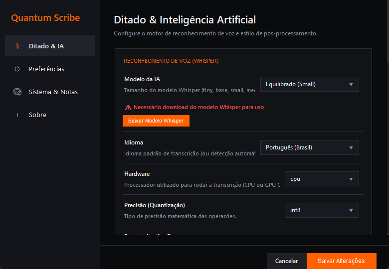
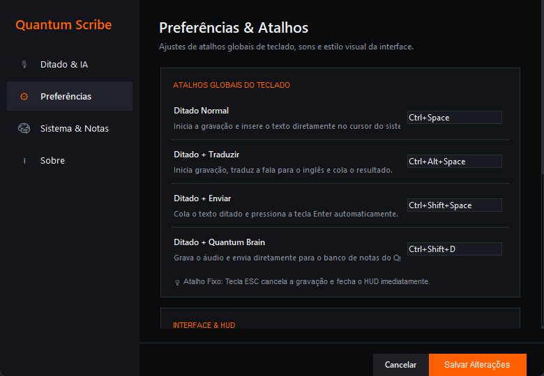
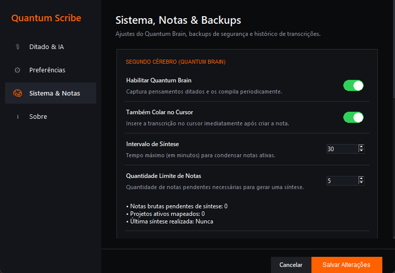
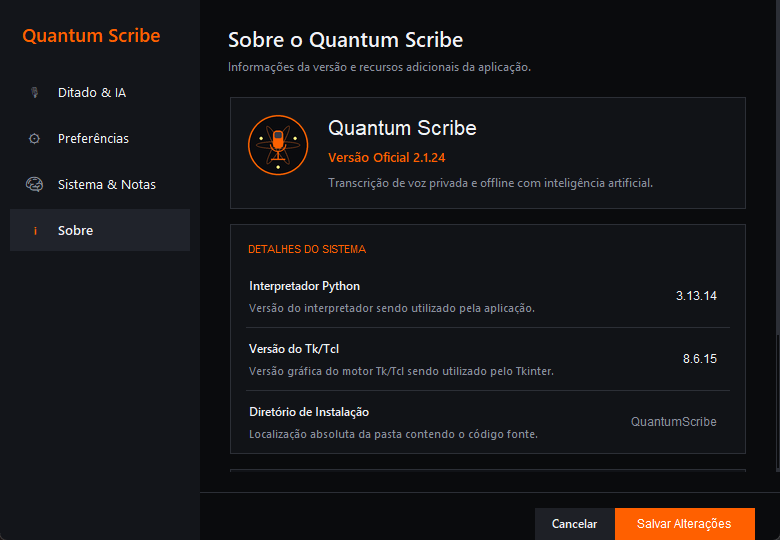
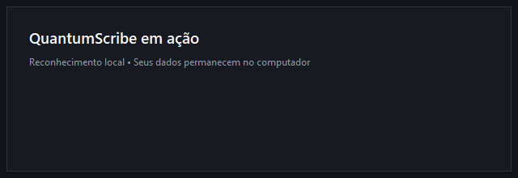
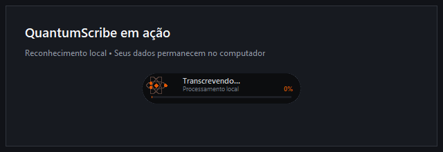
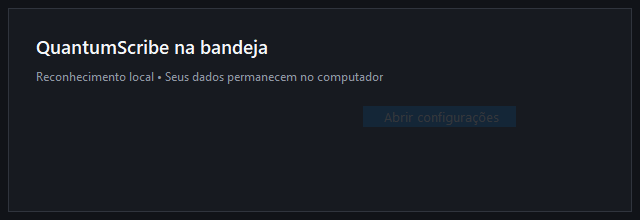

<div align="center">
  
  <h1>QuantumScribe</h1>
  <p><strong>Ditado por voz local, rápido e fiel ao que você falou.</strong></p>
  <p>Windows · faster-whisper · CPU ou NVIDIA CUDA · Português do Brasil</p>

  [](https://github.com/Natanmelquiades/QuantumScribe/actions/workflows/tests.yml)
  [](LICENSE)
  [](https://www.python.org/)
  [](https://www.microsoft.com/windows)
</div>

---

O **QuantumScribe** transforma sua voz em texto diretamente no campo que estiver
focado. O reconhecimento roda no seu computador com
[faster-whisper](https://github.com/SYSTRAN/faster-whisper), preserva a fala em modo
literal e usa pausas e construções interrogativas para melhorar a pontuação sem
trocar palavras.

> **English:** QuantumScribe is a local-first Windows dictation app powered by
> faster-whisper. It offers global shortcuts, literal transcription, conservative
> punctuation, auto-paste, optional CUDA acceleration and an offline second brain.



## Destaques

- **Local-first:** o áudio é transcrito localmente depois que o modelo é baixado.
- **Transcrição literal:** repetições, hesitações e palavras coloquiais podem ser
  preservadas sem uma LLM reescrever sua mensagem.
- **Pontuação conservadora:** detecta perguntas e pausas sem alterar o vocabulário.
- **Atalhos globais:** dite em navegadores, editores, chats e ferramentas de trabalho.
- **Auto-paste e autoenvio:** cola no cursor e, opcionalmente, pressiona Enter.
- **Tradução sob demanda:** produz texto em inglês usando o próprio Whisper.
- **CPU ou NVIDIA CUDA:** escolha portabilidade ou aceleração por GPU.
- **Quantum Brain:** transforma ditados em notas Markdown locais e sínteses offline.
- **Configuração visual:** modelos, áudio, atalhos, HUD, backups e histórico em um só painel.

## Interface

<table>
  <tr>
    <td></td>
    <td></td>
  </tr>
  <tr>
    <td></td>
    <td></td>
  </tr>
</table>

<p align="center">
  
  
  
</p>

## Requisitos

- Windows 10 ou Windows 11;
- Python 3.11 a 3.13 para executar pelo código-fonte;
- microfone reconhecido pelo Windows;
- conexão à internet apenas para instalar dependências e baixar modelos;
- espaço livre para o ambiente Python e o modelo escolhido;
- GPU NVIDIA opcional para aceleração CUDA.

Modelos maiores normalmente oferecem mais qualidade, mas consomem mais disco, RAM,
VRAM e tempo de inicialização no primeiro ditado.

| Perfil | Modelo | Indicação |
|---|---|---|
| Super leve | `tiny` | máquinas simples e testes rápidos |
| Leve | `base` | ditado curto com baixo consumo |
| Equilibrado | `small` | padrão recomendado para a maioria dos usuários |
| Pro | `medium` | maior qualidade, mais memória e processamento |
| Ultra | `large-v3` | máxima qualidade em hardware mais forte |

## Instalação rápida

### CPU — recomendada para começar

```powershell
git clone https://github.com/Natanmelquiades/QuantumScribe.git
cd QuantumScribe
.\run.ps1
```

Na primeira execução, o script cria `.venv`, instala o perfil CPU e inicia o app. Nas
execuções seguintes, ele abre diretamente sem reinstalar tudo.

### GPU NVIDIA CUDA

```powershell
.\run.ps1 -Setup -Cuda
```

> [!IMPORTANT]
> O perfil CUDA instala pacotes grandes. Verifique espaço em disco e compatibilidade
> do driver NVIDIA. Se CUDA falhar, o transcritor tenta recuar para CPU.

Também é possível abrir `Iniciar.bat` com duplo clique depois que o ambiente estiver
preparado.

## Como usar

1. Abra o QuantumScribe; ele ficará na bandeja do Windows.
2. Posicione o cursor no campo de texto desejado.
3. Pressione `Ctrl+Space` para começar a gravar.
4. Pressione `Ctrl+Space` novamente para concluir.
5. Aguarde a transcrição local e a inserção automática.

O modelo é carregado sob demanda no primeiro ditado para que a bandeja e as
configurações abram rapidamente. O primeiro processamento da sessão pode demorar
mais; os seguintes reutilizam o modelo em memória.

### Atalhos padrão

| Atalho | Ação |
|---|---|
| `Ctrl+Space` | iniciar ou concluir ditado normal |
| `Ctrl+Alt+Space` | ditar e traduzir para inglês |
| `Ctrl+Shift+Space` | ditar, colar e enviar |
| `Ctrl+Shift+D` | salvar ditado no Quantum Brain |
| `Esc` | cancelar gravação/processamento |

Todos os atalhos principais podem ser alterados nas configurações.

## Privacidade

A transcrição normal acontece localmente. O aplicativo acessa o Hugging Face quando
você solicita o download de um modelo. Não há telemetria própria no código.

O QuantumScribe mantém configurações, modelos, diário, notas, caches e logs em:

```text
%LOCALAPPDATA%\QuantumScribe
```

Transcrições e backups podem conter informações pessoais. Não publique esses
arquivos em issues. Leia [PRIVACY.md](PRIVACY.md) para conhecer todos os dados locais
e as conexões de rede.

## Configuração

Use **Configurações** no menu da bandeja. O arquivo persistido fica em
`%LOCALAPPDATA%\QuantumScribe\config.json`. Um exemplo seguro está em
[config.example.json](config.example.json).

Opções importantes:

- `literal_mode`: preserva as palavras sem pós-reescrita;
- `punctuation_assist`: melhora sinais terminais e pausas;
- `preload_model`: se `false`, carrega o modelo no primeiro ditado;
- `device`: `cpu`, `cuda` ou `auto`;
- `auto_paste`: insere o resultado no campo capturado;
- `use_llm_rewriter`: habilita reescrita opcional — desligada por padrão.

## Desenvolvimento

```powershell
python -m venv .venv
.\.venv\Scripts\python.exe -m pip install -r requirements-dev.txt
.\.venv\Scripts\python.exe -m pytest -q
.\.venv\Scripts\python.exe -m ruff check localwhisper tests
```

Os testes não precisam de microfone, GPU ou modelo Whisper baixado.

### Arquitetura resumida

```text
hotkeys/tray → app.py → audio.py → transcriber.py → punctuation/cleaner
                    ↘ HUD/UI               ↘ clipboard + auto-paste
                    ↘ diary / Quantum Brain / backups
```

Os módulos principais estão documentados no próprio código. Consulte
[CONTRIBUTING.md](CONTRIBUTING.md) antes de enviar mudanças.

## Build para Windows

```powershell
.\build.ps1          # perfil CPU
.\build.ps1 -Cuda    # perfil CUDA
```

O PyInstaller gera `dist\QuantumScribe\`. Distribua a pasta inteira compactada, não
somente o `.exe`, porque as DLLs e bibliotecas fazem parte do aplicativo.

## Solução de problemas

- **A bandeja não aparece:** confira o menu de ícones ocultos do Windows e o
  `%LOCALAPPDATA%\QuantumScribe\app.log`.
- **Atalho não responde:** verifique se outro programa registrou a mesma combinação.
- **Primeiro ditado demora:** o modelo está sendo carregado em RAM/VRAM sob demanda.
- **CUDA falha:** atualize o driver ou selecione CPU com `compute_type=int8`.
- **Modelo não baixa:** confira conexão, espaço livre e permissões da pasta local.
- **Texto não é colado:** confirme que o campo original ainda existe e que
  `auto_paste` está habilitado.

Ao relatar um bug, não anexe configurações, áudios ou transcrições pessoais. Consulte
[SECURITY.md](SECURITY.md).

## Roadmap

- instalador Windows assinado;
- benchmarks reproduzíveis de modelos e hardware;
- mais testes de integração de áudio e hotkeys;
- internacionalização da interface;
- perfis de configuração exportáveis sem dados pessoais.

## Licença

Código disponibilizado sob a [licença MIT](LICENSE). Dependências e modelos têm
licenças próprias; consulte [THIRD_PARTY_NOTICES.md](THIRD_PARTY_NOTICES.md).

---

<div align="center">
  Feito por <a href="https://github.com/Natanmelquiades">Natan Melquiades</a>.
  Se o QuantumScribe for útil, deixe uma ⭐ no repositório.
</div>
