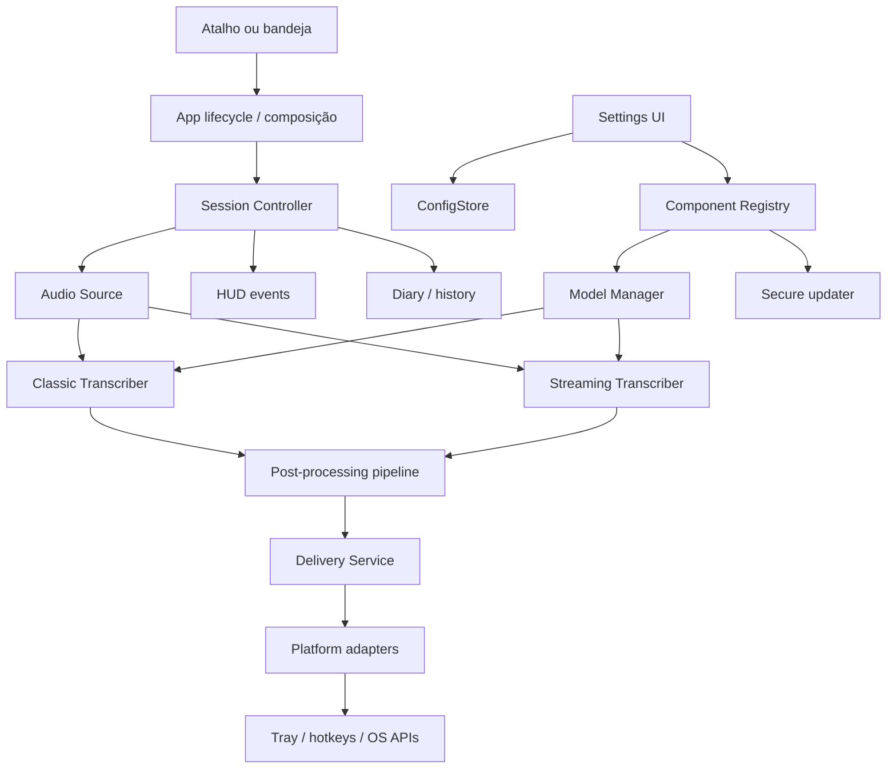
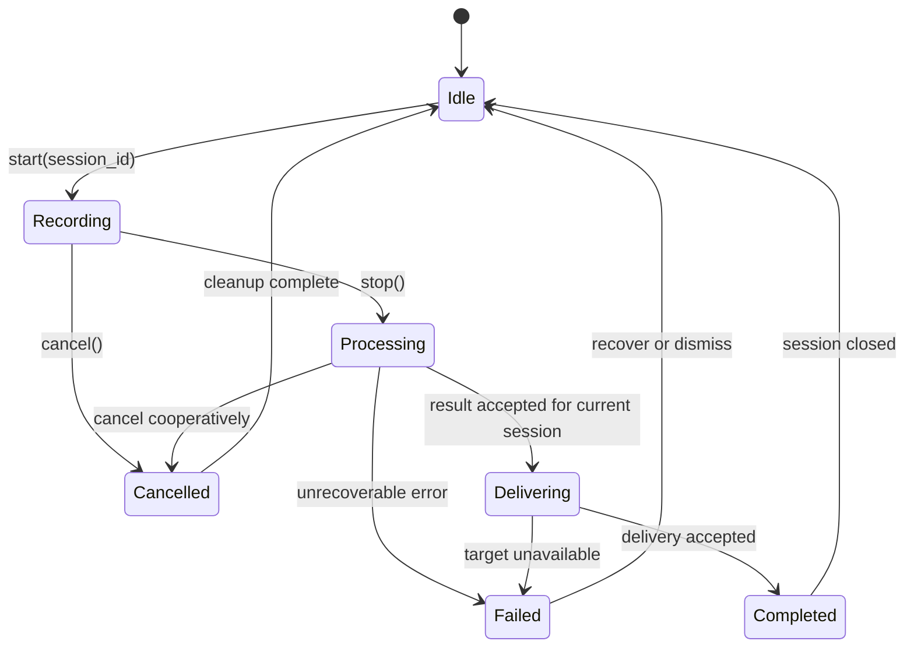

# QuantumScribe Brownfield Enhancement Architecture

**Projeto:** QuantumScribe  
**Enhancement:** Estabilização, Core leve, release reproduzível e modularização
incremental  
**Versão:** 1.1  
**Data:** 2026-08-18  
**Arquiteta:** @architect (Aria)  
**Status:** Em execução controlada — Stories 1.1 e 1.2 `Done`; Story 1.3 `Ready`,
com extração limitada e governança aprovadas  
**PRD:** [docs/prd.md](prd.md)  
**Epic:** [EPIC-QSAUDIT](prd/epic-1-quantumscribe-auditoria-estabilizacao.md)

---

## 1. Introduction

### 1.1 Purpose

Este documento define a arquitetura brownfield para melhorar o QuantumScribe sem
substituir sua base local e desktop. Ele estabelece limites entre orquestração,
áudio, transcrição, pós-processamento, UI, persistência, plataforma, componentes
opcionais e empacotamento.

O destino arquitetural é um **monólito modular local**, com contratos explícitos,
dependências em uma única direção e extrações incrementais. O documento não autoriza
uma reescrita completa, a introdução de microserviços ou a troca do framework visual.

### 1.2 Existing Project Analysis

#### Current Project State

| Item | Observação baseada no código e na auditoria |
| --- | --- |
| Propósito | Ditado por voz local para Windows e Linux com `faster-whisper`. |
| Arquitetura atual | Monólito desktop modular, com `app.py` como orquestrador amplo e módulos especializados ao redor. |
| UI | Tkinter/ttk e Pillow em `settings_ui.py`, `ui.py`, `theme.py`, `tray.py` e adaptadores de plataforma. |
| Entrada | Atalhos globais, bandeja e controles de interface. |
| Pipeline | Captura de áudio → transcrição clássica ou streaming → limpeza/pontuação/reescrita → entrega. |
| Persistência | Arquivos locais de configuração, diário/histórico, cache, vocabulário e modelos. |
| Componentes | `components.py`, `model_manager.py`, `updater.py` e scripts controlam downloads, modelos e componentes opcionais. |
| Plataforma | `localwhisper/platform/windows` e `localwhisper/platform/linux` isolam diferenças de hotkey/UI/WinAPI. |
| Distribuição | PyInstaller (`QuantumScribe.spec` e `QuantumScribe-Linux.spec`), scripts PowerShell e instalador NSIS. |
| Testes | Pytest em `tests/`, com 150 testes aprovados e 1 ignorado após as Stories 1.1 e 1.2. |
| Débito principal | `app.py` e `settings_ui.py` são grandes; existem funções E/F e cobertura desigual. |

#### Evidence from Audit

- Cobertura inicial aproximada de 31%, com lacunas em configurações, aplicação,
  streaming, transcrição, Quantum Brain, memória e cache de vocabulário.
- Complexidade identificada: `_transcribe_and_deliver` em `app.py` F(48),
  `_animate_atom` em `ui.py` E(40), `rewrite_text` em `rewriter.py` E(35), além
  de complexidade C/D em outros fluxos críticos.
- Bundle PyInstaller temporário de aproximadamente 333,8 MB e 1.434 arquivos.
- `requirements-common.txt` mistura dependências essenciais com `noisereduce`,
  SciPy e ONNX Runtime, apesar de existirem caminhos opcionais/fallback.
- `pip-audit`, `pip check`, Ruff e compilação passaram; o updater possui controles
  de origem HTTPS, hash, staging, tamanho e extração segura.
- A Story 1.2 produziu Core Windows de 219,354 MB e 1.326 arquivos, sem itens
  proibidos no inventário; perfis/locks e workflow de release estão separados.
- O repositório apresenta objetos Git ausentes/links quebrados e ownership
  inconsistente; a recuperação deve acontecer fora do checkout original.

#### Available Documentation

| Fonte | Estado | Uso arquitetural |
| --- | --- | --- |
| `docs/prd.md` | Disponível | Requisitos e compatibilidade. |
| `docs/prd/epic-1-quantumscribe-auditoria-estabilizacao.md` | Disponível | Sequenciamento, stories, riscos e gates. |
| `docs/PRD_CORE_LEVE_COMPONENTES_SOB_DEMANDA.md` | Disponível | Direção de distribuição e Core CPU. |
| `docs/PRD_QS017_ESTABILIDADE_HUD_INICIALIZACAO.md` | Disponível | Contratos de HUD, cancelamento e inicialização. |
| `docs/PRD_QS018_ATUALIZACAO_APLICATIVO.md` | Disponível | Atualização segura. |
| `docs/PRODUCT_BACKLOG.md` | Disponível | Contexto de itens relacionados. |
| `docs/architecture/` | Disponível | Mapas, limites, ADRs e decisões detalhadas. |
| `docs/framework/` | Disponível | Stack, padrões, árvore de origem e estratégia de testes canônicos. |
| `docs/stories/` | Stories 1.1/1.2 `Done`, 1.3 `Ready` | Fonte de execução por story. |

#### Identified Constraints

- Preservar Windows, Linux e Python `>=3.11,<3.14`.
- Preservar o fluxo local/offline-first e não enviar áudio/texto sem ação explícita.
- Preservar `device="auto"`, `compute_type="auto"` e fallback GPU → CPU.
- Preservar configurações, modelos, histórico, diário e arquivos existentes.
- Não instalar drivers, serviços ou dependências por `pip` na máquina final.
- Não introduzir microserviços ou novos runtimes sem evidência de necessidade.
- Não criar banco central; dados locais continuam em arquivos.
- Não usar exclusão recursiva arbitrária em atualização, desinstalação ou limpeza.
- Não reparar o Git por reset, prune ou reescrita destrutiva no checkout atual.

### 1.3 Changelog

| Change | Date | Version | Description | Author |
| --- | --- | --- | --- | --- |
| Criação | 2026-08-18 | 1.0 | Arquitetura brownfield com limites de módulos, integração, testes, segurança e handoff. | @architect (Aria) |
| Atualização | 2026-08-18 | 1.1 | Incorporados perfis Core/release da Story 1.2, documentação canônica e limites da Story 1.3. | @architect (Aria) |

---

## 2. Enhancement Scope and Integration Strategy

### 2.1 Enhancement Overview

**Enhancement Type:** Estabilidade, performance, redução de dependências,
reprodutibilidade de release e modularização de um sistema existente.  
**Scope:** As três stories do `EPIC-QSAUDIT`: contratos/regressão; Core e
componentes opcionais; modularização e governança.  
**Integration Impact:** Significativo, com impacto arquitetural controlado. A
primeira story é de baixo risco relativo; a segunda afeta distribuição; a terceira
afeta fronteiras internas e só pode avançar com mapa de dependências e testes.

### 2.2 Integration Approach

#### Code Integration Strategy

1. **Caracterizar antes de mover:** adicionar testes nos contratos existentes antes
   de extrair responsabilidades.
2. **Adicionar seams sem big bang:** introduzir contratos pequenos e adaptadores
   mantendo os módulos atuais como fachada temporária.
3. **Extrair por fluxo:** primeiro sessão/cancelamento e entrega; depois UI de
   configurações; por fim componentes e pipeline de build.
4. **Preservar nomes públicos internos:** aliases/fachadas podem permanecer durante
   uma migração para evitar que imports e testes quebrem simultaneamente.
5. **Remover somente após duas validações:** testes de regressão e build limpo devem
   confirmar que uma dependência ou módulo antigo não é mais necessário.

#### Database Integration

Não há banco de dados central. A arquitetura trata os arquivos locais como contratos
de dados:

- `config.json` permanece compatível e deve ser gravado atomicamente.
- Diário/histórico Markdown permanece a fonte de verdade.
- Modelos e snapshots já existentes não são removidos durante migração.
- Caches podem ser reconstruídos, mas nunca devem substituir dados originais.
- Manifestos de componentes devem ser aditivos e versionados.

#### API Integration

Não há API HTTP pública a adicionar. A comunicação interna deve usar chamadas
tipadas, dataclasses, `Protocol` ou callbacks explícitos, sem introduzir um event
bus genérico. Downloads/update continuam sendo integrações externas controladas e
não devem vazar para a camada de UI.

#### UI Integration

`settings_ui.py`, `ui.py` e `tray.py` continuam sendo adaptadores de apresentação.
Eles devem observar estados e emitir comandos, mas não devem:

- carregar diretamente o Whisper;
- decidir fallback de hardware;
- gravar JSON por conta própria;
- extrair arquivos de componentes;
- controlar threads de transcrição;
- conhecer detalhes de PyInstaller ou do instalador.

### 2.3 Compatibility Requirements

| Compatibilidade | Regra arquitetural |
| --- | --- |
| Fluxo principal | Gravar, transcrever, limpar, entregar e registrar continuam disponíveis. |
| Configuração | `AppConfig` continua sendo a representação central; escrita atômica e migração aditiva. |
| Hardware | `hardware.py` permanece a autoridade para resolver dispositivo/precisão. |
| Modelos | `model_manager.py` permanece a autoridade de existência, download e snapshot. |
| Componentes | `components.py`/manifestos permanecem a autoridade de ciclo de vida e integridade. |
| Plataforma | Código Windows/Linux passa por adaptadores em `localwhisper/platform`. |
| Build | Specs, locks, scripts e instalador só mudam após artefato comparável. |
| Dados do usuário | Nenhuma extração ou limpeza pode apagar histórico, modelos ou configurações. |
| Git | Qualquer recuperação ocorre em cópia ou clone canônico. |

---

## 3. Tech Stack Alignment

### 3.1 Existing Technology Stack

| Categoria | Tecnologia atual | Versão/limite | Uso no enhancement | Observações |
| --- | --- | --- | --- | --- |
| Linguagem | Python | `>=3.11,<3.14` | Todos os módulos e testes | Não trocar. |
| UI desktop | Tkinter/ttk + Pillow | Conforme ambiente atual | Estados de configuração, HUD, bandeja e progresso | Preservar padrões existentes. |
| STT | faster-whisper/CTranslate2 | `faster-whisper>=1.1.1,<2.0` | Transcrição clássica e base do Core | Caminho obrigatório. |
| Áudio | sounddevice + NumPy | Conforme locks | Captura, buffers e pré-processamento | Guardar contratos de tamanho/tipo. |
| Plataforma | APIs Windows/Linux e bibliotecas locais | Conforme requirements | Hotkeys, UI, tray e hardware | Isolar em adaptadores. |
| Bandeja | pystray + Pillow | `pystray>=0.19.5,<1.0` | Estado de execução e comandos | Não misturar com orquestração. |
| Testes | pytest | `requirements-test.lock` | Unitários, integração e regressão | Linha de base preservada. |
| Qualidade | Ruff, compileall, pip check, pip-audit | Configurados no projeto | Gates de story/release | Não substituir sem decisão. |
| Build | PyInstaller | `requirements-build.lock` | Artefatos Windows/Linux | Gerar inventário. |
| Instalador | NSIS | `installer/QuantumScribe.nsi` | Instalação/desinstalação Windows | Manter manifestos e proteção. |
| Dependências opcionais | SciPy/noisereduce/ONNX/CUDA/Torch/LLM | Perfis a separar | Apenas quando recurso estiver instalado/validado | Não podem inflar o Core sem justificativa. |

### 3.2 New Technology Additions

Não são necessárias novas tecnologias de infraestrutura ou novos frameworks. A
arquitetura recomenda apenas recursos já disponíveis na biblioteca padrão Python:

- `dataclasses` para estados e comandos imutáveis quando possível;
- `typing.Protocol` para contratos pequenos;
- `queue`, `threading` e `concurrent.futures` somente nos pontos já existentes;
- `pathlib`, `tempfile` e `os.replace` para persistência segura.

Adicionar um framework de injeção de dependência, um barramento de eventos ou um
runtime de processos seria desproporcional ao produto atual e fica fora de escopo.

---

## 4. Data Models and Schema Changes

### 4.1 New Persistent Data Models

**Nenhum novo banco, tabela ou migração destrutiva é necessário.** A arquitetura
separa modelos persistentes de modelos de execução.

| Artefato | Dono | Compatibilidade |
| --- | --- | --- |
| `config.json` | `config.py` / `ConfigStore` | Ler campos existentes; adicionar campos com defaults; escrever atomicamente. |
| Diário/histórico Markdown | `diary.py` | Manter arquivos e formato; índices são derivados. |
| Snapshot de modelo Whisper | `model_manager.py` | Reutilizar modelos existentes e validar snapshot antes de marcar instalado. |
| Cache de vocabulário/memória | `vocab_cache.py` / `memory.py` | Pode ser reconstruído sem apagar transcrições. |
| Manifesto de componentes | `components.py` / futuro `ComponentRegistry` | Versionar componente, arquivos, hash, estado e compatibilidade. |

### 4.2 Runtime Data Contracts

Estes contratos não são tabelas persistentes. Devem ser introduzidos somente quando
uma story os cobrir com testes:

```text
RecordingSession
  session_id: UUID/string
  started_at: datetime
  source: microphone identifier
  target: captured delivery target or explicit copy-only mode
  cancel_token: cooperative cancellation handle

TranscriptionResult
  session_id
  text
  language/metadata when available
  diagnostics
  source_mode: classic | streaming

SessionEvent
  session_id
  state: idle | recording | processing | delivering | completed | cancelled | failed
  progress when known
  recoverable: bool
  user_action: optional next action
```

O `session_id` evita que um worker antigo entregue texto depois de uma nova sessão.
O estado é uma fonte de observabilidade, não uma nova camada de negócio.

### 4.3 Schema Integration Strategy

**Database Changes Required:** Nenhuma.  
**New Tables:** Nenhuma.  
**Modified Tables:** Nenhuma.  
**New Indexes:** Nenhum obrigatório.  
**Migration Strategy:** Migração aditiva para JSON/manifests; preservar arquivos
desconhecidos e fazer backup temporário apenas durante a escrita, com substituição
atômica.

**Backward Compatibility:**

- Campos desconhecidos de configuração não devem causar falha de inicialização.
- Campos ausentes recebem defaults seguros.
- Modelos já baixados continuam detectáveis.
- Histórico e diário não são migrados de forma destrutiva.
- Componentes antigos permanecem reconhecíveis até a política de expiração ser
  definida em uma story própria.

---

## 5. Component Architecture

### 5.1 Architectural Principles

1. UI não conhece detalhes de infraestrutura.
2. Orquestração coordena; não implementa processamento profundo.
3. Cada pipeline possui uma autoridade única para seu estado.
4. Componentes opcionais são capability checks, não imports obrigatórios do Core.
5. Adaptadores de plataforma isolam WinAPI, hotkeys e diferenças Linux.
6. Dados do usuário são tratados como contratos de longa duração.
7. Não usar abstração genérica antes de haver dois consumidores reais.
8. Uma dependência só pode apontar para uma camada abaixo, nunca para a UI.

### 5.2 Existing and Target Boundaries

| Componente | Responsabilidade atual | Limite alvo |
| --- | --- | --- |
| `app.py` | Ciclo de vida, hotkeys, áudio, workers, entrega, UI e shutdown | Orquestrar ciclo de vida e conectar serviços; não processar áudio/transcrição diretamente. |
| `settings_ui.py` | Janela, navegação, controles, downloads e efeitos colaterais | Renderizar configurações e emitir comandos; delegar persistência/componentes/hardware. |
| `ui.py` | HUD, animação e estados visuais | Renderizar eventos de sessão; não decidir estado de transcrição. |
| `stream_transcriber.py` | Chunking, VAD, contexto e pipeline streaming | Ser dono apenas do pipeline streaming e emitir resultados/eventos. |
| `transcriber.py` | Carregamento e inferência Whisper | Ser dono do engine clássico e contrato de transcrição. |
| `rewriter.py` | Mini-LLM, download e reescrita | Ser capability opcional; não controlar lifecycle da aplicação. |
| `audio.py` | Captura e buffers | Ser fonte de áudio; não conhecer UI ou destino. |
| `audio_enhancer.py` | Filtros e normalização opcionais | Receber/retornar arrays válidos; falhar para caminho seguro. |
| `post_processor.py` e auxiliares | Limpeza, pontuação e vocabulário | Pipeline de transformação puro quando possível. |
| `config.py` | Modelo e persistência de configuração | Única autoridade de leitura/escrita/migração. |
| `model_manager.py` | Modelos Whisper | Download, snapshot, validação e remoção segura de modelos. |
| `components.py` | Componentes opcionais | Registro, compatibilidade, instalação e estado de componentes. |
| `updater.py` | Atualização do aplicativo | Rede segura, staging, validação e promoção; independente da UI. |
| `platform/*` | Diferenças de SO | Adaptadores sem regra de produto. |
| `diary.py`, `memory.py`, `vocab_cache.py` | Dados derivados e histórico | Persistência local especializada, sem controlar a sessão. |

### 5.3 Incremental Components to Introduce

#### `localwhisper/contracts.py`

**Responsabilidade:** contratos mínimos compartilhados (`RecordingSession`,
`TranscriptionResult`, `SessionEvent`, estados e Protocols).  
**Integração:** usado por `app.py`, UI, transcritores e testes; não importa Tkinter,
Whisper ou componentes opcionais.  
**Dependências:** biblioteca padrão.  
**Regra:** manter tipos pequenos e estáveis; não transformar o arquivo em um
container de utilidades.

#### `localwhisper/session_controller.py`

**Responsabilidade:** iniciar/encerrar uma sessão, associar `session_id`, cancelar de
forma cooperativa, aceitar resultado e garantir que apenas a sessão vigente entregue
texto.  
**Integração:** substitui gradualmente a parte de `_transcribe_and_deliver` em
`app.py`.  
**Dependências:** `audio`, um engine de transcrição, `delivery` e callbacks de
eventos.  
**Regra:** não criar widgets, não acessar `tkinter` e não escrever config.

#### `localwhisper/delivery.py` (quando Story 1.1 justificar)

**Responsabilidade:** clipboard, destino capturado, modo copy-only e entrega segura.
  
**Integração:** recebe `TranscriptionResult` e política de destino; conversa com
  adaptadores de plataforma.  
**Regra:** não deve conhecer Whisper, VAD ou UI interna.

#### `localwhisper/component_runtime.py` (somente se `components.py` ficar maior)

**Responsabilidade:** ativar/desativar componentes validados, pending restart,
  rollback e capability checks.  
**Integração:** `components.py` mantém manifesto/registro; o runtime consulta
  componentes sem importar Torch/CUDA no Core.  
**Regra:** nunca executar código recebido de componente e nunca instalar com pip no
  usuário final.

#### Extração da UI de configurações

Somente após contratos e testes, `settings_ui.py` pode ser dividido por páginas ou
seções. A primeira etapa deve manter a classe/fachada existente para reduzir risco.
Não criar um framework de componentes novo.

### 5.4 Dependency Direction

```text
Presentation (settings_ui, ui, tray, theme)
                  │ commands/events
                  ▼
Application (app, session_controller, lifecycle)
                  │ ports/contracts
                  ▼
Domain pipelines (audio, streaming, transcription, post-processing, delivery)
                  │ adapters
                  ▼
Infrastructure (config, models, components, updater, diary, platform, filesystem)
```

Regras de dependência:

- `domain` não importa `settings_ui`, `ui` ou `tray`.
- `config`, `model_manager`, `components` e `updater` não importam widgets.
- `platform` pode ser usado por adaptadores de áudio, hotkey, UI e entrega, mas não
  deve conter regra de produto.
- `app.py` pode compor tudo, mas novos serviços não devem importar `app.py` de volta.
- Testes podem usar fakes nos ports; não devem depender do processo completo quando
  um contrato unitário for suficiente.

### 5.5 Component Interaction Diagram



### 5.6 Session State Flow



Um evento de worker cujo `session_id` não corresponde à sessão atual deve ser
descartado e registrado como stale result; nunca deve colar texto em outro destino.

---

## 6. API Design and Integration

### 6.1 API Strategy

**API Integration Strategy:** Não criar API HTTP/REST/GraphQL neste enhancement.
Usar contratos internos pequenos e explícitos entre orquestração, pipelines e
adaptadores.

**Authentication:** N/A para APIs internas. Downloads e update usam HTTPS, allowlist
de origem, hashes e staging; não há sessão de usuário remota.

**Versioning:** Contratos internos evoluem junto ao aplicativo. Mudanças de
configuração/manifesto devem ser aditivas e ter compatibilidade de leitura.

### 6.2 Internal Contracts

| Contrato | Produtor | Consumidor | Falha esperada |
| --- | --- | --- | --- |
| `RecordingSession` | Session Controller | Audio/Transcriber/Delivery | Sessão cancelada ou stale result. |
| `TranscriptionResult` | Classic/Streaming Transcriber | Post-processing/Delivery/Diary | Resultado inválido ou vazio, tratado sem crash. |
| `SessionEvent` | Application/Session | HUD/Tray/Diagnostics | Evento descartado se sessão não for atual. |
| `ConfigStore` | Config module | App/UI/Services | Último arquivo válido preservado. |
| `ComponentManifest` | Component registry | Installer/runtime/UI | Hash, origem ou compatibilidade inválida bloqueia ativação. |

---

## 7. External API Integration

### 7.1 Existing Download Integrations

Não há nova API externa a introduzir. O sistema já possui operações de download de
modelos, componentes e atualizações. Elas devem permanecer atrás de serviços de
infraestrutura, nunca em widgets ou pipelines de transcrição.

Regras:

- Apenas origens permitidas e HTTPS.
- Revisão/repositório compatível fixado quando aplicável.
- Arquivo `.part`/staging durante download.
- Validação de tamanho e SHA-256 antes de uso.
- Extração protegida contra path traversal.
- Promoção atômica.
- Cancelamento e retomada sem marcar snapshot parcial como instalado.
- Diagnóstico sem áudio/texto pessoal.

### 7.2 Failure Handling

- Falha primária deve preservar o Core e o snapshot anterior.
- Retry tem limite e backoff; não pode criar downloads concorrentes descontrolados.
- Hash inválido bloqueia ativação e limpa somente o staging da tentativa.
- Falha de componente pode resultar em `not_installed` ou `pending_restart`, nunca
  em estado visual falso de `ready`.
- O updater existente deve continuar sendo reutilizado, não reescrito neste epic.

---

## 8. Source Tree Integration

### 8.1 Existing Relevant Structure

```text
QuantumScribe/
├── localwhisper/
│   ├── app.py                    # Orquestrador atual amplo
│   ├── audio.py                  # Captura e buffers
│   ├── audio_enhancer.py         # Filtros opcionais
│   ├── components.py             # Componentes opcionais
│   ├── config.py                 # AppConfig e persistência
│   ├── diary.py                  # Histórico/diário
│   ├── hardware.py               # Resolução CPU/GPU
│   ├── model_manager.py          # Modelos Whisper
│   ├── post_processor.py         # Pós-processamento
│   ├── rewriter.py               # Mini-LLM opcional
│   ├── settings_ui.py             # Painel de configurações amplo
│   ├── stream_transcriber.py     # Pipeline contínuo/VAD
│   ├── transcriber.py             # Whisper clássico
│   ├── ui.py                      # HUD
│   ├── updater.py                 # Atualização segura
│   ├── platform/{windows,linux}/ # Adaptadores por SO
│   └── ...
├── tests/                         # Pytest unitário/integração
├── scripts/                       # Build auxiliar e documentação
├── QuantumScribe.spec             # PyInstaller Windows
├── QuantumScribe-Linux.spec       # PyInstaller Linux
├── requirements-*.txt/lock        # Perfis e locks atuais
├── build.ps1 / run.ps1
└── installer/QuantumScribe.nsi
```

### 8.2 New File Organization

Adicionar somente quando a story correspondente estiver pronta:

```text
QuantumScribe/
├── localwhisper/
│   ├── contracts.py               # Novos tipos/Protocolos estáveis
│   ├── session_controller.py     # Extração do lifecycle de sessão
│   ├── delivery.py               # Extração opcional da entrega de texto
│   ├── app.py                    # Mantém fachada e composição
│   ├── settings_ui.py            # Mantém fachada durante migração
│   └── components.py             # Evolui como registry antes de criar runtime separado
├── docs/
│   ├── architecture.md           # Este documento
│   ├── framework/
│   │   ├── tech-stack.md         # Próximo documento
│   │   └── coding-standards.md   # Próximo documento
│   └── stories/                  # Stories criadas pelo @sm
└── tests/
    ├── test_contracts.py         # Quando contracts.py existir
    ├── test_session_controller.py
    └── test_delivery.py          # Quando delivery.py existir
```

Não criar todos os arquivos antecipadamente. Cada novo módulo deve nascer junto
com uma story, um teste mínimo e uma decisão de responsabilidade.

### 8.3 Integration Guidelines

- **File Naming:** preservar snake_case e nomes de módulos existentes.
- **Folder Organization:** preferir módulos planos no primeiro ciclo; criar pacotes
  somente quando houver coesão real e mais de dois arquivos relacionados.
- **Imports:** imports de componentes opcionais devem ocorrer sob demanda; evitar
  imports de UI em módulos de domínio; evitar imports circulares.
- **Public Surface:** usar `__init__.py` apenas para exports estáveis; não expor
  internals para resolver conveniência de import.
- **Tests:** testes próximos ao contrato e testes de integração nos locais existentes
  em `tests/`.
- **Migration:** manter fachadas/aliases temporários durante a extração e removê-los
  somente após um ciclo completo de testes/build.

---

## 9. Infrastructure and Deployment Integration

### 9.1 Existing Infrastructure

**Current Deployment:** Build local/CI para executáveis Windows/Linux, com PyInstaller
e instalador NSIS no Windows.  
**Infrastructure Tools:** PowerShell, requirements por perfil, locks, PyInstaller,
NSIS e scripts em `scripts/`.  
**Environments:** Desenvolvimento/teste; build limpo; instalação/smoke test Windows;
build/smoke test Linux; publicação de artefato conforme pipeline existente.

### 9.2 Enhancement Deployment Strategy

**Deployment Approach:**

1. Story 1.1 em branch de desenvolvimento, sem alterar o contrato de instalação.
2. Story 1.2 com artefato comparável, inventário e perfil Core/optional.
3. Story 1.3 somente depois de arquitetura e testes aprovados.
4. Release gradual, mantendo artefato anterior conhecido como bom.

**Infrastructure Changes:**

- Separar/validar locks de runtime, build, teste e componentes.
- Adicionar inventário de bundle e relatório de tamanhos.
- Adicionar smoke tests de instalação/execução por plataforma.
- Não adicionar serviços, drivers, tarefas agendadas ou infraestrutura remota.

**Pipeline Integration:**

- Executar lint, testes, `compileall`, `pip check` e `pip-audit` antes do build.
- Buildar em ambiente limpo a partir dos locks.
- Inspecionar artefato e componentes opcionais.
- Publicar checksums/SBOM quando suportado pelo pipeline existente.
- Bloquear release se o Core incluir dependência proibida ou download silencioso.

### 9.3 Rollback Strategy

**Rollback Method:** Artefato anterior conhecido como bom, manifesto anterior,
rollback por componente e reversão de uma extração por vez.  
**Risk Mitigation:** Staging, promoção atômica, versionamento de componentes,
compatibilidade de config e testes de instalação limpa.  
**Monitoring:** Logs/diagnóstico de inicialização, fallback, downloads, hash,
ativação, pending restart e falhas de entrega; sem registrar áudio/texto pessoal.

Para o Git, rollback significa abandonar o checkout corrompido somente depois de
preservar alterações e continuar em clone canônico. Não significa executar comandos
destrutivos no checkout atual.

---

## 10. Coding Standards and Conventions

### 10.1 Existing Standards Compliance

**Code Style:** Python existente, funções e módulos snake_case, docstrings em
português em partes do produto e tipos modernos quando já adotados.  
**Linting Rules:** Ruff configurado no `pyproject.toml`, target Python 3.11,
line-length 110 e regras E/F/I/W com exceções declaradas.  
**Testing Patterns:** Pytest em `tests/`, mocks/fakes para hardware, arquivos,
download e plataforma; testes de ciclo de vida para streaming/transcrição/update.  
**Documentation Style:** Markdown em `docs/`, PRDs e documentos AIOX; decisões de
arquitetura devem ser registradas junto ao documento canônico/ADR.

### 10.2 Enhancement-Specific Standards

- **Contratos pequenos:** Protocols/dataclasses não devem importar implementações
  pesadas ou UI.
- **Estados explícitos:** usar estados nomeados para lifecycle; não usar strings
  soltas divergentes entre app/HUD/tray.
- **Session identity:** toda operação assíncrona precisa carregar `session_id` ou
  token equivalente.
- **Optional capability:** testar `available`, `installed`, `compatible`, `active`
  como estados distintos.
- **Atomic persistence:** arquivo temporário no mesmo diretório, flush/fsync quando
  aplicável e `os.replace`.
- **Safe filesystem:** resolver caminho, verificar namespace e bloquear diretórios
  raiz/parentes antes de remover.
- **No hidden behavior:** nenhuma dependência opcional pode ser baixada por importar
  uma tela ou marcar um toggle sem confirmação.

### 10.3 Critical Integration Rules

- **Existing API Compatibility:** manter interfaces internas atuais até a migração
  estar coberta; não mudar assinaturas amplas em uma única story.
- **Database Integration:** não introduzir banco; preservar arquivos locais e
  migração aditiva.
- **Error Handling:** erros de componente, GPU, download e sessão devem degradar para
  um caminho seguro e produzir diagnóstico acionável.
- **Logging Consistency:** logs técnicos devem ser estruturados o suficiente para
  diagnóstico, mas nunca conter áudio, texto ditado, tokens ou segredos.
- **Threading:** workers não atualizam widgets diretamente; eventos devem retornar ao
  thread de UI por mecanismo existente seguro.
- **Import boundaries:** módulos de domínio não importam UI; UI não importa engine
  pesado só para descobrir estado.

---

## 11. Testing Strategy

### 11.1 Integration with Existing Tests

**Existing Test Framework:** Pytest.  
**Test Organization:** `tests/` com módulos para áudio, cache, componentes,
configuração, downloads, hardware, plataforma, streaming, ciclo de vida,
transcrição, updater e empacotamento.  
**Coverage Requirements:** manter a linha de base, não reduzir cobertura nos módulos
tocados e aumentar cobertura orientada a risco em `app.py`, `settings_ui.py`,
`stream_transcriber.py`, `transcriber.py`, `rewriter.py`, `quantum_brain.py`,
`memory.py` e `vocab_cache.py`.

### 11.2 New Testing Requirements

#### Unit Tests for New Components

- **Framework:** Pytest.
- **Location:** `tests/test_contracts.py`, `tests/test_session_controller.py`,
  `tests/test_delivery.py` e testes específicos junto aos módulos existentes.
- **Coverage Target:** 100% dos invariantes de contrato e estados de erro; para o
  restante, nenhuma queda nos arquivos alterados e cobertura definida por risco na
  story.
- **Integration with Existing:** usar fakes para `AudioSource`, `Transcriber`,
  `Delivery` e `ConfigStore`; evitar iniciar Tkinter ou Whisper real em unit tests.

#### Integration Tests

- **Scope:** sessão completa controlada, cancelamento, resultado stale, escrita de
  config, modelo/componentes, fallback CPU, build/import e instalação.
- **Existing System Verification:** gravar/transcrever/entregar/registrar histórico
  em ambiente controlado; validar HUD/tray por adaptadores ou smoke test.
- **New Feature Testing:** confirmar que novos contratos realmente substituem a
  coordenação antiga sem duplicar entrega ou worker.

#### Regression Tests

- **Existing Feature Verification:** hotkey, áudio, transcrição clássica, streaming,
  cancelamento, clipboard, HUD, bandeja, configurações, histórico e updater.
- **Automated Regression Suite:** `pytest`, Ruff, compileall, pip check, pip-audit e
  teste de requirements/build.
- **Manual Testing Requirements:** instalação limpa CPU; GPU/fallback quando
  disponível; primeira execução offline; download interrompido; componente inválido;
  atualização; desinstalação segura; DPI/teclado nas telas tocadas.

### 11.3 Test Sequence by Story

| Etapa | Gates |
| --- | --- |
| Antes da alteração | Suíte baseline, coverage inicial, snapshot de bundle e diff de arquivos. |
| Durante Story 1.1 | Unit tests de contratos, ciclo de vida e regressão local. |
| Durante Story 1.2 | Requirements/import tests, build limpo, inventário, smoke test e auditoria. |
| Durante Story 1.3 | Testes de caracterização após cada extração, radon e revisão arquitetural. |
| Antes do release | Suíte completa, build por alvo, instalação, fallback, segurança, rollback e checklist QA. |

---

## 12. Security Integration

### 12.1 Existing Security Measures

**Authentication:** Não há autenticação de usuário no fluxo local principal.  
**Authorization:** Controle local por instalação/configuração; não há API pública
multiusuário.  
**Data Protection:** Áudio/texto permanecem locais por padrão; updater e downloads
usam HTTPS, allowlist, hash, limites, staging e extração segura.  
**Security Tools:** `pip-audit`, checksums/hashes, testes do updater, validação de
path traversal, inspeção de requirements e revisão manual.

### 12.2 Enhancement Security Requirements

**New Security Measures:**

- separar perfis para reduzir superfície do Core;
- bloquear imports/downloads opcionais silenciosos;
- registrar ownership de arquivos de componentes;
- validar todos os caminhos antes de extrair/remover;
- manter secrets fora de logs e arquivos versionados;
- usar locks e hashes em releases.

**Integration Points:** `components.py`, `model_manager.py`, `updater.py`,
`QuantumScribe.spec`, instalador NSIS, scripts de build e config/persistência.

**Compliance Requirements:** não há requisito regulatório formal identificado neste
escopo. A arquitetura mantém princípio de minimização de dados e privacidade local;
qualquer modo cloud exigirá PRD e revisão de privacidade separados.

### 12.3 Security Testing

**Existing Security Tests:** testes do updater, componentes, model manager,
requirements e packaging, além de `pip-audit`.  
**New Security Test Requirements:** hash inválido, origem não permitida, arquivo
`.part`, path traversal, componente incompatível, caminho de desinstalação adulterado,
manifesto divergente, config parcial e logs sem conteúdo pessoal.  
**Penetration Testing:** não é necessário teste de penetração de rede para o escopo
local atual; revisão de filesystem, supply chain e downloads é obrigatória. Um modo
cloud futuro exigirá avaliação própria.

---

## 13. Architect Checklist Results Report

### 13.1 Executive Summary

**Readiness:** Médio/Condicional.  
**Tipo:** Aplicativo desktop full-stack local, com frontend desktop, runtime de
processamento e infraestrutura de build/distribuição.  
**Força principal:** o produto já possui separação parcial de plataforma, testes
relevantes, fallback CPU e updater com controles de segurança.  
**Risco principal:** `app.py`/`settings_ui.py` concentram responsabilidades e a
documentação arquitetural ainda não existe no repositório.

### 13.2 Section Analysis

| Seção | Pass rate estimado | Status | Observação |
| --- | ---: | --- | --- |
| 1. Requirements Alignment | 90% | PASS | PRD completo; métricas de cobertura/build ainda serão medidas por story. |
| 2. Architecture Fundamentals | 80% | PASS | Limites definidos; extrações ainda não implementadas. |
| 3. Tech Stack & Decisions | 85% | PASS | Stack existente preservada; perfis opcionais precisam ser finalizados. |
| 4. Frontend Design & Implementation | 70% | PARTIAL | UI existente é conhecida, mas falta guideline único e teste visual amplo. |
| 5. Resilience & Operational Readiness | 75% | PARTIAL | Fallbacks e updater são fortes; observabilidade e locks ainda têm gaps. |
| 6. Security & Compliance | 85% | PASS | Não há auth/API; downloads, filesystem e supply chain são os focos. |
| 7. Implementation Guidance | 80% | PASS | Sequenciamento e contratos claros; standards documentais ainda pendentes. |
| 8. Dependency & Integration Management | 75% | PARTIAL | Dependências mapeadas; separação e locks Linux ainda pendentes. |
| 9. AI Agent Implementation Suitability | 85% | PASS | Stories e boundaries claros; evitar mudanças grandes fora de story. |
| 10. Accessibility | 60% | PARTIAL | Contrastes/teclado/DPI foram exigidos, mas precisam de verificação manual. |

### 13.3 Top Risks by Severity

1. **Crítico:** reparar Git de forma destrutiva ou perder alterações do proprietário.
2. **Alto:** refatorar lifecycle e entrega sem proteger sessões stale/cancelamento.
3. **Alto:** reduzir bundle e omitir import/DLL ou degradar qualidade de transcrição.
4. **Alto:** download/componente opcional tornar-se silencioso ou inseguro.
5. **Médio/alto:** introduzir abstrações demais e aumentar a complexidade em vez de
   reduzi-la.

### 13.4 Must-Fix Before Structural Development

- Criar stories detalhadas da Story 1.1 e seus testes de caracterização.
- Confirmar mapa de chamadas e dependências de `app.py`/`settings_ui.py` com o @dev.
- Definir e testar o contrato de `session_id`, cancelamento e stale result.
- Confirmar locks e inventário de bundle antes de remover dependências.
- Escolher cópia/remote/cloning strategy para o Git antes de qualquer recuperação.

### 13.5 Should-Fix for Quality

- Criar `docs/framework/tech-stack.md` e `coding-standards.md`.
- Adicionar ADRs para monólito modular, componentes opcionais e fallback CPU.
- Medir cobertura por risco e definir thresholds por módulo tocado.
- Adicionar smoke test instalado em Windows e Linux.
- Documentar estados de UI e diagnóstico.

### 13.6 Sections Skipped or Not Applicable

- API HTTP pública: não aplicável; contratos internos foram documentados.
- Banco de dados: não aplicável; o produto usa arquivos locais.
- Autenticação/autorização multiusuário: não aplicável ao fluxo atual.
- Penetration testing de rede: não necessário neste escopo; supply chain/filesystem
  permanecem obrigatórios.

---

## 14. Next Steps

### 14.1 Story Manager Handoff

As Stories 1.1 e 1.2 estão concluídas com gates QA `PASS`. A Story 1.3 está `Ready`
e deve executar T1 → T2 → T3 → T4 → T5, mantendo o mapa de imports e a
caracterização como bloqueios antes de novas extrações.

### 14.2 Developer Handoff

@dev/@devops, implemente a partir das stories refinadas e não diretamente deste
documento. Preserve os módulos atuais como fachadas durante a migração.

Decisões técnicas obrigatórias:

- monólito modular local, sem microserviços;
- contratos pequenos em `contracts.py` somente quando cobertos por testes;
- lifecycle em `session_controller.py` extraído incrementalmente;
- UI sem conhecimento de Whisper, downloads ou filesystem de componentes;
- Core CPU independente de opcionais;
- `device="auto"`/`compute_type="auto"` e fallback CPU preservados;
- config/modelos/histórico compatíveis e nunca apagados por migração;
- downloads com staging, hash e promoção atômica;
- rollback por story e build anterior preservado.

### 14.3 Immediate Sequence

1. @dev implementa a Story 1.3 a partir do seam de `session_controller.py` e dos
   documentos canônicos.
2. @architect revisa o mapa, a direção de imports e a equivalência do lifecycle.
3. @qa executa os gates e registra cobertura/complexidade.
4. @pm aprova a story e encerra o epic se todos os critérios forem atendidos.
5. Recuperação Git continua em fluxo operacional separado, com o proprietário.

---

**Generated by:** AIOX Architect brownfield architecture workflow  
**Template:** `brownfield-architecture-template-v2`  
**Architecture stance:** monólito modular local, extração incremental, Core mínimo e
componentes opcionais controlados
