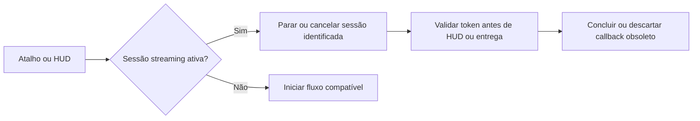

# Auditoria de estabilidade e integridade - Solution Design

> Decisão formada por auditoria local e debate de cinco revisores independentes.

## Overview

**Goal**: eliminar falhas confirmadas de segurança, estado e interface sem alterar comportamento não relacionado.

**Readiness Score**: 94/100

**Review Gate**: aprovado por consenso de cinco revisores, com mudanças limitadas a correções reproduzíveis e testes de regressão.

**Generated**: 2026-08-14

## Requirements Summary

### Problem Statement

O streaming não podia ser encerrado pelo próprio atalho e podia manter captura ativa após o HUD desaparecer. A interface também permitia ou anunciava estados que não eram executados: IA no modo literal, modelo ainda não instalado e downloads sem revisão aprovada.

### Scope

Inclui ciclo mínimo de streaming, invariantes de configuração, validação de hotkeys, seleção de modelo e integridade dos downloads da UI. Ficam fora a reformulação completa de workers, mudanças de release, limpeza de artefatos e remoção de compatibilidades persistidas.

### Success Criteria

- [x] O mesmo atalho encerra uma sessão de streaming ativa.
- [x] HUD e Esc direcionam cancelamento ao streaming ativo.
- [x] Callbacks obsoletos não atualizam o HUD atual.
- [x] O modo literal não persiste IA ou aprendizado incompatíveis.
- [x] Downloads com progresso recebem revisão pinada.
- [x] Modelos ausentes não se tornam ativos antes da instalação validada.
- [x] Hotkeys ambíguas ou conflituosas são rejeitadas.

### Constraints

- Preservar deleções locais pré-existentes e não limpar artefatos sem autorização.
- Não prometer interromper threads nativas de decodificação em execução.
- Manter pontuação assistida compatível com o modo literal.

## Architecture

### Approach

Cada sessão de streaming recebe identificador que acompanha início, cancelamento, callback e conclusão. O app só aceita ações que ainda pertençam à sessão atual. A UI torna estados incompatíveis informativos, em vez de clicáveis.

### Key Components

- **`QuantumScribeApp`**: controla sessão, HUD, Esc e entrega do streaming.
- **`AppConfig` e SettingsWindow**: preservam invariantes e apresentam controles dependentes de forma honesta.
- **Download helpers**: propagam revisão pinada no caminho de progresso da interface.
- **Hotkey parser**: exige uma tecla principal e evita colisões antes da persistência.

### Data Flow

## Implementation Plan

### Step 1: Corrigir ciclo de vida do streaming

- **Actions**: tratar streaming antes do guard genérico, registrar Esc com token, rotear HUD/ESC para cancelamento real e suprimir callbacks antigos.
- **Deliverables**: ciclo iniciar, parar e cancelar com estado consistente.
- **Dependencies**: testes com dublês de sessão e HUD.

### Step 2: Impedir estados de configuração impossíveis

- **Actions**: normalizar antes de salvar e rebaixar controles incompatíveis com transcrição literal, aprimoramento ou remoção de hesitações.
- **Deliverables**: UI coerente e configuração persistida válida.
- **Dependencies**: regras existentes de literal em `AppConfig`.

### Step 3: Proteger seleção, download e hotkeys

- **Actions**: manter o modelo funcional até o snapshot estar completo, propagar revisões pinadas e validar sintaxe e conflitos dos atalhos.
- **Deliverables**: downloads determinísticos e controles de atalho previsíveis.
- **Dependencies**: `MODEL_REVISIONS`, `_PINNED_REVISIONS` e parser de plataforma.

### Step 4: Validar e registrar trabalho futuro

- **Actions**: executar testes focados e completos, lint e simulações de UI; registrar as melhorias maiores no backlog.
- **Deliverables**: evidência de regressão e itens QS-021 a QS-026.
- **Dependencies**: decisão sobre o manifesto de dependências ausente.

## Technical Considerations

- O token evita efeito tardio, mas não mata em segurança uma inferência nativa já iniciada; isso permanece em QS-023.
- O helper de rewriter pinado é preservado por conter allowlist necessária.
- Authenticode e manifesto assinado precisam de desenho de pipeline, não de alteração pontual.

## Risk Management

| Risk | Impact | Likelihood | Mitigation |
| --- | --- | --- | --- |
| Callback antigo alterar HUD | Alto | Médio | Token e checagem antes da atualização |
| Download flutuante trazer versão não revisada | Alto | Médio | Revisão obrigatória no helper de progresso |
| Configuração persistir estado inválido | Médio | Médio | Normalização ao alterar e ao salvar |
| Limpeza apagar trabalho local | Alto | Médio | Não restaurar/remover arquivos pré-existentes |

## Acceptance Criteria

- [x] Cenários focados de streaming, UI, download, configuração e hotkeys passam.
- [ ] Suíte completa e lint passam após incremento de versão.
- [ ] Instalação limpa é validada após decisão sobre o manifesto ausente.

## Debate Summary

| Papel | Posição integrada |
| --- | --- |
| Auditor de UI | Corrigir controles que parecem ativos sem efeito. |
| Auditor de runtime | Priorizar streaming, cancelamento e sessões obsoletas. |
| Auditor de manutenção | Preservar compatibilidade e registrar código morto antes de remover. |
| Revisor de segurança | Preservar pins e allowlist; corrigir bypass da UI. |
| Presidente do consenso | Aplicar somente patch atômico e testar; backlog para o restante. |

## Appendix

### Alternatives Considered

- **Reescrever toda a máquina de estados agora**: descartado por risco amplo de regressão; registrado em QS-023.
- **Apagar flags, buffers e artefatos imediatamente**: descartado até inventário, migração e confirmação de propriedade das deleções locais (QS-026).
- **Restaurar `requirements-base.txt` automaticamente**: descartado porque o arquivo já estava removido no worktree e a intenção do usuário não é conhecida.
